# Audit-LM

> An agentic RAG system that turns customer conversations into structured sales leads — built for small and medium businesses.

[](https://huggingface.co/spaces/Vinayak-0/Audit-LM)
[](https://groq.com/)
[](https://opensource.org/licenses/MIT)

Most RAG chatbots are passive - they answer a question and move on. Audit-LM watches _how_ users talk, picks up on buying signals, and quietly converts conversations into structured CRM leads. It's customer support and lead generation running from the same system.

## Architecture



The request pipeline runs left to right through three layers. The Streamlit frontend hands off to the intelligence engine, which classifies intent, retrieves and reranks document chunks, runs inference via Groq, and extracts any lead data from the response before it reaches the user. Redis handles session memory synchronously; all Supabase writes (leads and audit logs) happen asynchronously so they never block the response.

## Features

**Intent-aware responses.** A dedicated classifier runs on every message before retrieval. It distinguishes a "just browsing" query from one that signals purchase intent, and adjusts the system prompt accordingly — shifting the AI from a neutral assistant to a subtle sales partner when appropriate.

**Automatic lead capture.** When a user shares their name, email, phone number, or use-case naturally in conversation, the lead extractor parses and validates that information in the background and writes it to a Supabase CRM table. No forms, no interruptions.

**Hybrid retrieval.** Documents are indexed using both dense embeddings (ChromaDB) and sparse BM25 scoring. Results are merged and reranked by a FlashRank cross-encoder before being passed to the LLM, which improves answer quality on both keyword-heavy and semantic queries.

**Audit logging.** Every interaction — the original query, retrieved chunks, and the final AI response — is logged to Supabase. Business owners can review this to understand user behaviour and identify gaps in the knowledge base.

**Persistent session memory.** Conversation history is stored in Upstash Redis, so the model has context across turns without loading previous messages from a database on every request.

## Project structure

```
.
├── app.py                  # Streamlit app — entry point
├── ingest.py               # Ingestion pipeline: load → chunk → embed → store
├── interactive_test.py     # CLI tool for testing retrieval and responses locally
├── requirements.txt
│
├── config/
│   ├── config.yaml                  # All runtime settings (models, chunking, thresholds)
│   └── audit_lm_architecture.svg    # System architecture diagram
│
├── core/                  # Core pipeline modules
|   |
│   ├── intent.py          # Intent classification
│   ├── retriever.py       # hybrid retriever + reranker
│   ├── inference.py       # Groq LLM Inference
│   ├── extractor.py       # Lead Extraction
│   └── logger.py          # Audit Logging
│   └── memory.py          # Session Memory
│   └── load_config.py     # Load Configuration
│
├── data/                   # Knowledge base — edit these to customise the assistant
│   ├── knowledge_base.json      # Primary structured Q&A / product content
│   ├── qa_pairs.json            # Additional curated question-answer pairs
│   └── owlflow-web-text.pdf     # Example PDF source document
│
└── vectorstore/            # Persisted ChromaDB embeddings (auto-generated by ingest.py)
```

## Tech stack

Everything runs on free tiers. This is a production-capable setup that costs $0 at modest scale.

| Component           | Technology              | Provider            |
| ------------------- | ----------------------- | ------------------- |
| LLM                 | Llama 3.3 (70B)         | Groq Cloud          |
| Vector database     | ChromaDB                | Local / self-hosted |
| Relational database | PostgreSQL              | Supabase            |
| Session memory      | Redis                   | Upstash             |
| Sparse retrieval    | BM25                    | `rank_bm25`         |
| Reranking           | FlashRank cross-encoder | Local               |
| Frontend            | Streamlit               | Hugging Face Spaces |

## Getting started

### 1. Clone and install

```bash
git clone https://github.com/vinayakpareek-0/AUDIT-QA.git
cd audit-lm
pip install -r requirements.txt
```

### 2. Configure environment variables

Copy `.env.example` to `.env` and fill in the following keys:

```env
# Groq — https://console.groq.com/
GROQ_API_KEY=

# Upstash Redis — https://console.upstash.com/
UPSTASH_REDIS_URL=
UPSTASH_REDIS_TOKEN=

# Supabase — https://supabase.com/dashboard/
SUPABASE_URL=
SUPABASE_KEY=

# Optional — only needed for automated Hugging Face deployments
HF_TOKEN=
```

### 3. Add your content

Place your business documents in the `data/` directory. Supported formats are PDF and JSON. The `knowledge_base.json` file is the primary source — structure it as an array of objects with `question` and `answer` fields. The `qa_pairs.json` file holds additional curated pairs that get indexed alongside the main document.

### 4. Run the ingestion pipeline

```bash
python ingest.py
```

This loads all files from `data/`, splits them into chunks, generates embeddings, and saves the vectorstore to the `vectorstore/` directory. Re-run this whenever you update your content.

### 5. Launch the app

```bash
streamlit run app.py
```

The app will be running at `http://localhost:8501`.

## Configuration

All runtime settings live in `config/config.yaml`. The main options:

```yaml
llm:
  model: llama-3.3-70b-versatile
  temperature: 0.4
  max_tokens: 1024

retrieval:
  top_k: 10 # Number of chunks fetched before reranking
  rerank_top_n: 3 # Number of chunks passed to the LLM after reranking
  chunk_size: 512
  chunk_overlap: 64

intent:
  buying_threshold: 0.65 # Confidence above which buying intent is flagged

lead_extraction:
  fields: [name, email, phone, use_case]
```

## Testing locally

`interactive_test.py` provides a simple CLI loop for testing retrieval and responses without starting the full Streamlit app. Useful for checking that ingestion worked correctly and that the pipeline is returning relevant chunks.

```bash
python interactive_test.py
```

Enter a query at the prompt and it will print the retrieved chunks, the reranked results, the detected intent, and the final response.

## Database setup

Audit-LM needs two tables in your Supabase project. Run the following SQL in the Supabase SQL editor before first launch:

```sql
-- Captured leads
CREATE TABLE public.leads (
    id BIGINT GENERATED BY DEFAULT AS IDENTITY PRIMARY KEY,
    session_id TEXT,
    full_name TEXT,
    email TEXT,
    phone TEXT,
    use_case TEXT,
    status TEXT DEFAULT 'New', -- New, Contacted, Converted
    created_at TIMESTAMPTZ DEFAULT NOW()
);


-- Interaction audit log
CREATE TABLE public.audit_logs (
    id BIGINT GENERATED BY DEFAULT AS IDENTITY PRIMARY KEY,
    session_id TEXT,
    query TEXT,
    context_summary TEXT,
    response TEXT,
    timestamp TIMESTAMPTZ DEFAULT NOW()
);

```

## License

MIT
